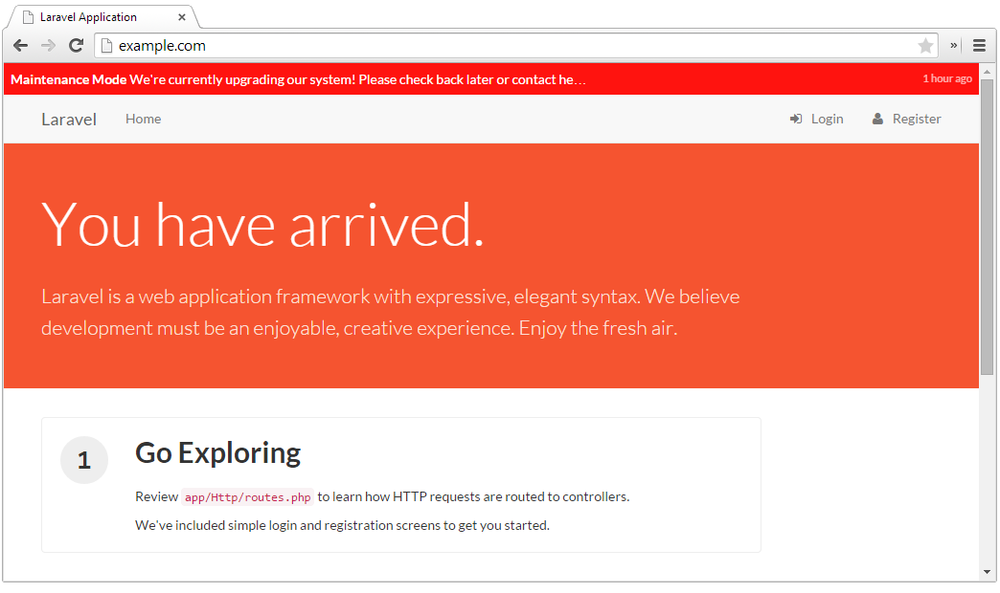

# Enhanced Laravel 5 Maintenance Mode

This package enhances the default Laravel 5 maintenance mode by:
 - Allowing custom maintenance messages to show to users
 - Including a timestamp of when the application went down
 - Exempting select users via custom exemption classes

## Installation

Within `composer.json` add the following line to the end of the `require` section:

    "misterphilip/maintenance-mode": "dev-master"

Next, run the Composer update command:

    $ composer update

Then include `'MisterPhilip\MaintenanceMode\MaintenanceModeServiceProvider',` to the end of the
`$providers` array in your `config/app.php`:

	'providers' => [

		/*
		 * Application Service Providers...
		 */
		'App\Providers\AppServiceProvider',
		'App\Providers\EventServiceProvider',
		'App\Providers\RouteServiceProvider',

		...

		'MisterPhilip\MaintenanceMode\MaintenanceModeServiceProvider',
    ],

Finally, in `app/Http/Kernel.php` replace

    'Illuminate\Foundation\Http\Middleware\CheckForMaintenanceMode',

with

    'MisterPhilip\MaintenanceMode\Http\Middleware\CheckForMaintenanceMode',

## Usage

This package uses the same syntax as the default app down command, except with 1 optional argument:

    $ php artisan down [message]

For example,

    $ php artisan down "We're doing some routine maintenance! Be back soon!"

Would show users a message of "We're doing some routine maintenance! Be back soon!". If you don't
pass in a message the default "We're currently working on the site, please try again later" will
display to the users. Of course this default is configurable via a language string.

To bring your application back online, run the normal app up command:

    $ php artisan up

## Configuration

### Overriding Defaults

If you feel like overriding the default configuration files, run the following command:

    $ php artisan public:config misterphilip/maintenancemode

Now you can edit the values at `config/packages/misterphilip/maintenancemode/config.php`.

## Exemptions

Exemptions allow for select users to continue to use the application as normal based on specific
set of rules. Each of these rule sets are defined via a class and then executed against.

### Default exemptions

By default, an IP whitelist and an application environment whitelist are included with this package
to get you off the ground running. Additionally, more examples are provided for various types of
exemptions that might be useful to your application.

##### IP Whitelist

This exemption allows you to check the user's IP address against a whitelist. This is useful for
always including your office IP(s) so that your staff doesn't see the maintenance page.

Configuration values included with this exemption are:

  - `exempt-ips` - An array of IPs that will not see the maintenance page
  - `exempt-ips-proxy` - Set to `true` if you have IP proxies setup

##### Environment Whitelist

This exemption allows you to check if the current environment matches against a whitelist. This is
useful for local development where you might not want to see the maintenance page.

Configuration values included with this exemption are:

  - `exempt-environments` - An array of environments that will not display the maintenance page
 
### Creating a new exemption

Setting up a new exemption is simple.

  1. Create a new class and extend `MisterPhilip\MaintenanceMode\Exemptions\MaintenanceModeExemption`.
  Where you place this is up to you, some examples are `app\Exemptions` or `app\Infrastructure\Maintenance`
  2. This class must include an `isExempt` method. This method should return `true` if the user should
  *not* see the maintenance page, or `false` if the user does not match your ruleset and should continue
  checking other exceptions.
  3. Add the full class name to the `exemptions` array in the configuration file.

Below is an template to use for a new exemption class `SampleExemption`:

    <?php namespace App\Exemptions;

    use MisterPhilip\MaintenanceMode\Exemptions\MaintenanceModeExemption;

    class SampleExemption extends MaintenanceModeExemption
    {
        /**
         * Execute the exemption check
         *
         * @return bool
         */
        public function isExempt()
        {
            return true; // or false
        }
    }

## Views

We include a simple view that displays the message and the timestamp for your users. To change this page, 
update the `view` configuration value to point to the new view. The following variables are available for 
you to use:

  - `$MaintenanceModeEnabled` - Check to see if the maintenance mode is enabled
  - `$MaintenanceModeMessage` - The message that should be displayed to users (either the one passed via 
  the command call, or the default from the language file)
  - `$MaintenanceModeTimestamp` - The timestamp from when the application went into maintenance mode

**NOTE**: If you've changed the `inject.prefix` configuration value, you'll need to reflect it in the variable 
names above. For example, if `inject.prefix = "Foobar"`, your view variables would be `$FoobarEnabled`, 
`$FoobarMessage`, and `$FoobarTimestamp`. 

**NOTE**: By default these variables are available in all views. To disable this and have it only inject 
variables on the maintenance page, change the `inject.global` configuration value to `false`.

##### Maintenance Notification

We've included a maintenance notification in our `/examples` directory for users that want to include a notice 
to those that are exempt from seeing the maintenance page. We've found that as an admin, it's helpful to know 
when your application is in maintenance mode in the event that you've forgotten to disable it or it was turned 
on automatically. 